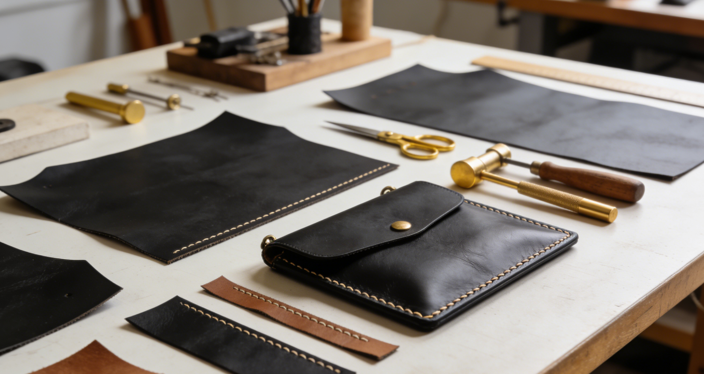
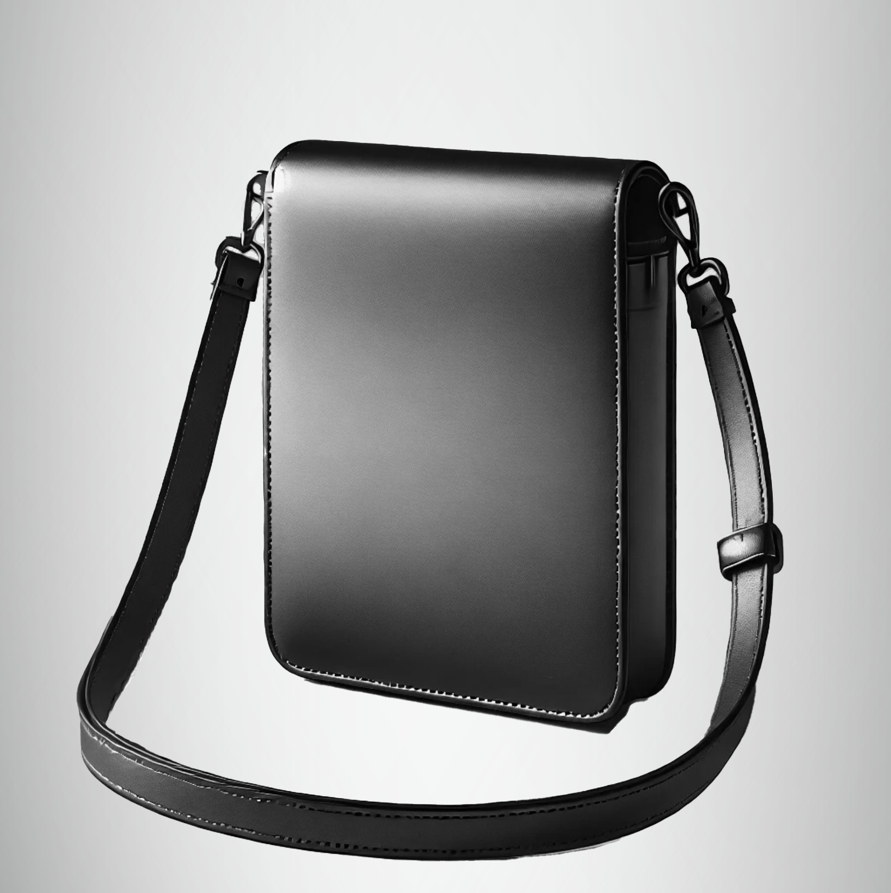

<!-- 仿网页的顶部横幅 -->

  

<!-- 品牌标题（仿网页淡入视觉） -->
<h1 align="center" style="font-family:'Playfair Display', serif; font-size:4rem; color:#3A2E24; margin:40px 0 20px;">
  Luvigo
</h1>

<!-- 品牌介绍 -->

  from Sweden, with elegance and timeless sophistication, renowned for modern design and refined aesthetic.

<!-- Bestseller区域 -->

  <h2 style="font-family:'Playfair Display', serif; font-size:2.5rem; color:#3A2E24; margin-bottom:30px;">Bestseller</h2>
  

<!-- 页脚 -->
<footer align="center" style="background-color:#3A2E24; color:#F8F4E9; padding:30px 0; border-radius:8px; margin-top:60px;">
  
© 2026 Luvigo - All Rights Reserved

</footer>
